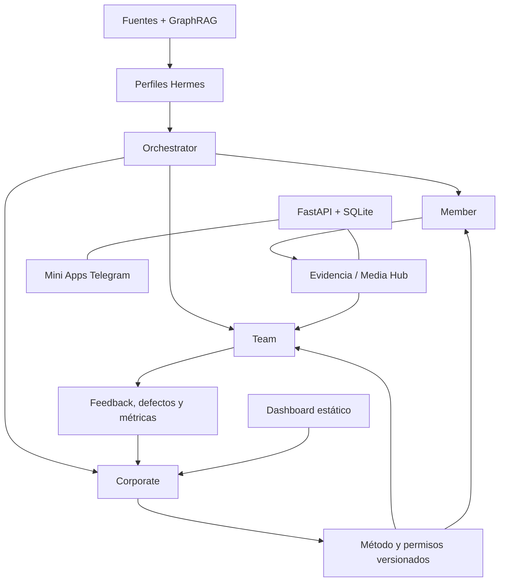

# Arquitectura

## Componentes

### Perfiles Hermes

Paquetes separados para Orchestrator, Member, Team y Corporate. Cada rol conserva identidad, permisos, skills, memoria y workspace propios. Los artefactos runtime (`state.db`, sesiones, tokens, caché y logs) no se transfieren.

### Dashboard

Next.js 16, React 19 y TypeScript. Se exporta estáticamente. La interacción actual usa `localStorage` e IndexedDB, por lo que no existe sincronización central entre navegadores.

Fuente: [dashboard README](../../beglobal/dashboard/README.md).

### Mini Apps y API

- Implementación multiperfil bajo `beglobal/miniapps/`: interfaces Member, Team y Corporate con una API común.
- Implementación Member paralela bajo `beglobal-member-miniapp/`: React/Vite y otro backend FastAPI.
- FastAPI como backend.
- SQLite en WAL con foreign keys.
- Telegram `initData` con HMAC, expiración y allowlist declarados.
- Media Hub con aislamiento y límite configurable.
- Nginx, TLS y systemd documentados como despliegue previsto.

Fuente: [Mini Apps README](../../beglobal/miniapps/README.md).

### Conocimiento

- Inventario y transcripciones derivadas de contenido público de YouTube.
- Corpus para Graphify.
- Grafo JSON/GraphML y reporte de comunidades.
- `SOURCE_MANIFEST.md` por perfil para precedencia.
- El perfil Corporate activo usa además una federación local observada de 986 nodos, 2.344 relaciones y 250 fuentes. Ese snapshot y su builder no forman parte de `origin/main`; no se transfieren como si fueran fuente canónica.

El grafo incluye relaciones inferidas y no sustituye fuentes primarias ni aprobación Corporate.

### Auditoría

El esquema contempla `audit_trail`, decisiones, gates y telemetría. Su presencia es implementación; la integridad referencial está actualmente rota en la suite y no existe evidencia de auditoría extremo a extremo en producción.

## Límites actuales

- Las dos implementaciones de Mini App/backend no constituyen todavía una arquitectura coherente ni comparten contrato verificado.
- API y dashboard no comparten un backend confirmado.
- La persistencia del dashboard es local.
- La cobertura CI es parcial: existe workflow en la implementación Member independiente y lockfile en el dashboard, pero no un gate reproducible para todo el piloto; la implementación Member independiente carece de lockfile.
- Los servicios vivos y el commit desplegado no están vinculados mediante evidencia verificable.
- No hay aceptación completa con cuentas separadas.
