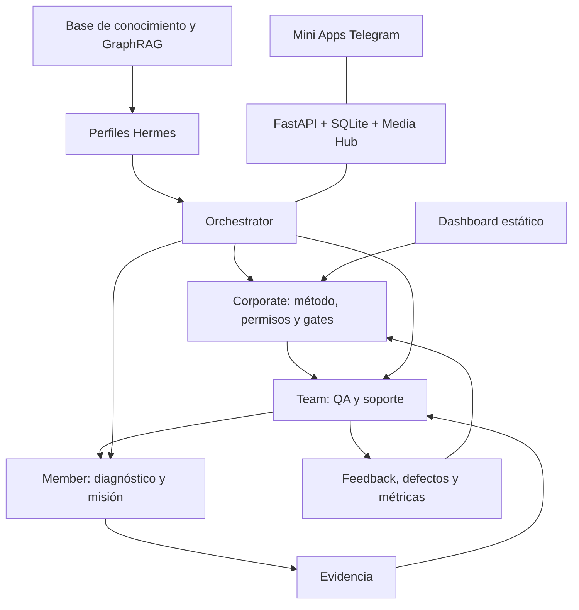

# Wiki operativa — BeGlobal

> Fuente durable para entender, operar y auditar BeGlobal.  
> Estado revalidado: **2026-08-01 01:04 CST**. Los datos vivos deben volver a comprobarse antes de cada reporte.

## 1. Resumen ejecutivo

**BeGlobal** es un sistema operativo de onboarding, capacitación, ejecución guiada y gobierno para Be Global Pro. Convierte conocimiento de ecommerce en un ciclo observable:

**diagnóstico → siguiente acción → recurso → entregable → evidencia → revisión humana → métricas → mejora del método.**

El producto combina:

- una base de conocimiento creada desde contenido de Be Global Pro;
- cuatro perfiles Hermes separados por responsabilidad;
- un dashboard estático de control del piloto;
- Mini Apps de Telegram para Member, Team y Corporate;
- FastAPI, SQLite, Media Hub, gamificación, notificaciones y auditoría.

### Resultado mínimo que debe demostrar

Un Member completa un diagnóstico y una misión, Team revisa su evidencia y Corporate observa métricas y una decisión auditables. El Orchestrator solo identifica y enruta el perfil.

### Estado global

**🔴 No listo para desplegar las Mini Apps.**

La base funcional es amplia y el dashboard público responde, pero el backend tiene una regresión de integridad referencial, pruebas fallidas, rutas duplicadas y riesgos de seguridad. La siguiente fase no es agregar funciones: es estabilizar un único flujo completo.

---

## 2. Identidad y fuentes de verdad

- **Canal Slack:** `#proyecto-beglobal` (`C0BLW4L9LS3`)
- **Workspace local:** `/Users/rogergv/Documents/SoftvibesLab/BeGlobal`
- **Repositorio:** <https://github.com/softvibeslab/beglobal>
- **Rama principal:** `main`
- **Contexto operativo:** [`../../PROJECT_CONTEXT.md`](../../PROJECT_CONTEXT.md)
- **Dashboard público:** <https://lavenderblush-ibex-989145.hostingersite.com>
- **Arquitectura de Mini Apps:** [`../../beglobal/miniapps/README.md`](../../beglobal/miniapps/README.md)
- **Plan:** [`../../beglobal/miniapps/PLAN.md`](../../beglobal/miniapps/PLAN.md)
- **Perfiles Hermes:** [`../../hermes/BEGLOBAL_PROFILES.md`](../../hermes/BEGLOBAL_PROFILES.md)
- **Permisos:** [`../../hermes/BEGLOBAL_PERMISSIONS_MATRIX.md`](../../hermes/BEGLOBAL_PERMISSIONS_MATRIX.md)
- **Runbook:** [`../../hermes/BEGLOBAL_ACTIVATION_RUNBOOK.md`](../../hermes/BEGLOBAL_ACTIVATION_RUNBOOK.md)

### Cómo interpretar las fuentes

1. El código y las pruebas actuales prevalecen sobre documentos históricos.
2. Un plan describe intención, no necesariamente implementación.
3. Un servicio “activo” en un reporte antiguo no cuenta como estado vivo.
4. Métricas sin evidencia deben mostrarse como **sin datos**.
5. Nunca exponer tokens, llaves, credenciales o datos personales en reportes.

---

## 3. Personas y responsabilidades

| Perfil | Usuario principal | Responsabilidad | Límite |
|---|---|---|---|
| **Orchestrator** | Cualquier participante | Identificar contexto y enrutar | No hereda permisos ni cambia roles |
| **Member** | Socio piloto | Diagnosticar, aprender, ejecutar y entregar evidencia | Solo ve sus datos |
| **Team** | Coach, soporte u operación | Revisar, puntuar, dar feedback y escalar | Solo casos asignados |
| **Corporate** | Sponsor o propietario del método | Aprobar conocimiento, permisos, gates y decisiones | Acceso individual solo bajo gobierno |

### Decisión de gobierno pendiente

Algunos documentos y código presentan una promoción automática `Member → Team → Corporate` basada en actividad y XP. Eso choca con la separación organizacional de responsabilidades. Para el piloto, cualquier cambio de rol debe requerir **designación explícita de Corporate**, no solo gamificación.

---

## 4. Arquitectura



Principio rector:

> La autoridad baja mediante versiones aprobadas; los aprendizajes suben mediante evidencia.

### Componentes

#### Base de conocimiento

- 270 videos inventariados.
- 24 transcripciones completas; 246 registros con metadatos y URL.
- Corpus Graphify: 27 archivos y aproximadamente 204 mil palabras.
- Grafo: 310 nodos, 1,428 relaciones y 10 comunidades.
- Temas: onboarding, ecommerce, marca, estrategia, copywriting, Amazon, sistema Be Global Pro, dropshipping, ventas de temporada y contabilidad.

Fuentes:

- [`../../README.md`](../../README.md)
- [`../../graphify-out/GRAPH_REPORT.md`](../../graphify-out/GRAPH_REPORT.md)
- [`../../graphify-out/graph.json`](../../graphify-out/graph.json)
- [`../../raw/youtube/beglobalpro/`](../../raw/youtube/beglobalpro/)

#### Perfiles Hermes

Perfiles declarados:

- `beglobal-orchestrator`
- `beglobal-member`
- `beglobal-team`
- `beglobal-corporate`

Cada perfil mantiene configuración, identidad, skills, permisos, memoria y workspace separados. No se deben copiar secretos, sesiones ni memoria del perfil histórico `beglobal-pro`.

#### Dashboard del piloto

Next.js 16, React 19 y TypeScript, exportado como sitio estático. Incluye resumen, perfiles, onboarding, reuniones, workflows, Media Hub, conocimiento, personalización, métricas y riesgos.

La información interactiva se guarda actualmente en `localStorage` e IndexedDB. **No existe sincronización central entre dispositivos.**

Fuente: [`../../beglobal/dashboard/README.md`](../../beglobal/dashboard/README.md).

#### Mini Apps y API

- Frontends: Orchestrator, Member, Team y Corporate.
- Backend: FastAPI.
- Persistencia: SQLite con WAL y foreign keys.
- Autenticación: `initData` de Telegram con HMAC, expiración y allowlist por perfil.
- Archivos: Media Hub configurable; límite predeterminado de 20 MB.
- Operación prevista: Nginx + TLS + systemd.

Rutas principales:

- [`../../beglobal/miniapps/api/main.py`](../../beglobal/miniapps/api/main.py)
- [`../../beglobal/miniapps/api/auth.py`](../../beglobal/miniapps/api/auth.py)
- [`../../beglobal/miniapps/api/db.py`](../../beglobal/miniapps/api/db.py)
- `beglobal/miniapps/api/gamification.py` — presente en trabajo local aún no publicado.
- `beglobal/miniapps/api/notifications.py` — presente en trabajo local aún no publicado.
- [`../../beglobal/miniapps/webapp/`](../../beglobal/miniapps/webapp/)

---

## 5. Flujos del producto

### Member

```text
Precheck → diagnóstico → ruta recomendada → lección → misión
→ carga de evidencia → revisión Team → aprobación o cambios → aceptación
```

El primer valor buscado es un guion completo o un brief de tienda utilizable en menos de 30 minutos.

### Team

```text
Nueva evidencia → cola de revisión → inspección → score 1–5
→ feedback → aprobar o pedir cambios → notificar → registrar actividad
```

### Corporate

```text
Métricas reales → gates y riesgos → propuesta de decisión
→ aprobación/rechazo → registro de actor, recurso y fecha → go/no-go
```

### Conocimiento

```text
Corporate cura y aprueba método → Team prueba casos controlados
→ Member ejecuta → Team documenta calidad y defectos
→ Corporate aprueba una nueva versión
```

### Casos de uso del piloto

1. **Contenido:** convertir producto, foto o referencia en gancho, guion, copy, CTA y plan de tomas.
2. **Tienda o catálogo:** completar marca, productos, precios, canal, pagos, envíos e imágenes hasta producir un brief operativo revisable.

El piloto debe elegir **solo uno** antes de ampliar alcance.

---

## 6. Dominios y datos

| Dominio | Entidades principales |
|---|---|
| Identidad | `users` |
| Onboarding | `stages`, `progress`, `diagnosis_responses` |
| Evidencia y soporte | `evidence`, `escalations`, `resources` |
| Formación | `lessons`, `lesson_progress`, `learning_sessions` |
| Misiones | `missions`, `mission_progress` |
| Gamificación | `gamification`, `achievements` |
| Gobierno | `decisions`, `gates`, `audit_trail` |
| Operación | `telemetry` |

Contenido semilla documentado:

- 10 lecciones;
- 10 misiones;
- 11 logros.

La existencia de seeds no demuestra que los recursos o URLs estén curados y listos para un piloto.

---

## 7. Guardrails

- Diagnosticar antes de recomendar.
- Dar de una a tres acciones, no una lista infinita.
- Exigir evidencia observable.
- No prometer ventas, ingresos ni “productos ganadores”.
- Pagos, reembolsos, reclamos y acciones sensibles requieren intervención humana.
- Member solo ve sus datos; Team solo participantes asignados.
- Corporate usa métricas agregadas salvo autorización explícita.
- No compartir secretos, memoria ni archivos privados entre perfiles.
- Escrituras en plataformas externas requieren QA y aprobación.
- `DEV_BYPASS=1` es solo para desarrollo local.

---

## 8. Estado técnico verificado

### Git — 🟠

Al 2026-08-01 01:04 CST:

- HEAD local: `538ecec`.
- `origin/main`: `b49c3a3`.
- `main` local: **7 commits adelante, 0 detrás**.
- `README.md` está modificado.
- `PROJECT_CONTEXT.md` y seis guías de Mini Apps están sin seguimiento.
- No se debe empujar `main` mientras la suite esté roja y los commits pendientes no estén revisados.

### Backend y pruebas — 🔴

Verificación ejecutada con SQLite y Media Hub temporales:

- compilación de sintaxis Python: aprobada;
- `test_phase1.py`: código de salida 1;
- schema, seeds, logros y métricas básicas avanzan;
- siete escenarios reportan error y el cleanup queda bloqueado.

Causa raíz inmediata:

```text
users PRIMARY KEY (tg_id, profile)
audit_trail FOREIGN KEY (actor_tg_id) REFERENCES users(tg_id)
```

La FK apunta a una columna que no es única por sí sola. Los `database is locked` posteriores son efectos en cascada de errores y conexiones no cerradas.

Otros defectos detectados:

- cuatro rutas duplicadas: Corporate metrics, decisions, gates y Team missions queue;
- partes de Corporate devuelven datos de demostración hardcodeados;
- el flujo de onboarding contiene un `INSERT` de gamificación inconsistente;
- algunos endpoints de escalamiento/notificaciones devuelven listas vacías;
- la suite consulta al menos una columna que no existe en el esquema actual.

### Seguridad — 🔴

Antes de producción:

- autenticar el webhook de Telegram con secreto verificable;
- parametrizar filtros SQL;
- validar elegibilidad y cambios de rol dentro de una transacción;
- escapar contenido dinámico enviado como Telegram HTML;
- declarar `requests` en dependencias o usar una alternativa ya instalada;
- validar tipo/contenido de uploads, no solo tamaño;
- probar aislamiento Member/Team/Corporate y replay/expiración de `initData`.

No se encontraron secretos rastreados con el escaneo heurístico realizado. Eso no reemplaza un escaneo automatizado en CI.

### Dashboard — 🟢/🟠

- `npm run check`: aprobado en la auditoría.
- build estático limpio: aprobado en la auditoría.
- URL pública: HTTP 200 verificado el 2026-08-01.
- No está confirmado que esa URL publique exactamente el HEAD local.
- La persistencia sigue siendo local al navegador.

### CI y reproducibilidad — 🔴

- no hay pipeline CI detectado;
- no hay lockfile npm;
- dependencias Python usan rangos abiertos;
- faltan pruebas end-to-end de auth, roles, archivos y notificaciones.

### Mini Apps/VPS — 🔴 / no verificable

Pendientes:

- bots separados para Member, Team y Corporate;
- tokens y allowlists por perfil;
- dominio y TLS;
- despliegue y healthcheck de la API;
- backup/restore y rollback;
- hardening del VPS.

El reporte del 2026-07-30 menciona un orquestador activo y riesgos de Ubuntu fuera de soporte, UFW inactivo, servicios root y puertos Docker publicados. El acceso SSH actual fue rechazado, por lo que eso es **evidencia histórica, no estado vivo**.

---

## 9. Conocimiento: qué existe y qué falta

### Existe

- inventario amplio del canal;
- grafo consultable;
- comunidades temáticas;
- perfiles, permisos y guardrails documentados;
- guías de operación y despliegue;
- estructura de lecciones, misiones y logros.

### Falta para convertirlo en currículo aprobado

- ampliar o priorizar cobertura de transcripciones;
- asociar cada respuesta a fuente, versión y aprobador;
- curar una ruta mínima, no los 270 videos;
- completar URLs de lecciones y recursos;
- definir alta, revisión, vigencia y retiro de conocimiento;
- separar afirmaciones verificadas, propuestas y supuestos.

### Ficha mínima de una pieza de conocimiento

- objetivo y fase del Member;
- fuente primaria y fragmento;
- propietario;
- versión y fecha;
- estado: borrador, probado por Team, aprobado por Corporate o retirado;
- audiencia autorizada;
- entregable y criterio de aceptación;
- riesgos e historial de cambios.

---

## 10. Modelo comercial — documentado, no validado

Documentos del proyecto mencionan:

- precio estándar de 3,500 MXN por agente, pago único;
- piloto propuesto de tres agentes por 7,500 MXN;
- upsells de video, publicación, integraciones y automatización.

No están verificados pago, contrato, garantía, cuotas, costos reales, margen, SLA ni disposición de pago posterior. La oferta mínima debe vender el resultado, no la arquitectura:

> Piloto de ejecución asistida Be Global: onboarding, diagnóstico, una misión guiada, revisión humana y medición de valor.

---

## 11. Ruta mínima de piloto

### Gate 0 — Acuerdo

- nombrar sponsor, Product Owner, Team y uno o dos Members;
- aprobar precio, duración, misión, datos permitidos, soporte y criterios de éxito;
- elegir **contenido** o **tienda**, no ambos;
- confirmar Telegram, bots, allowlists y responsable humano.

### Gate 1 — Estabilización técnica

- corregir esquema/migración de `audit_trail`;
- cerrar conexiones y hacer rollback seguro en errores;
- reparar onboarding y la suite;
- consolidar rutas duplicadas;
- retirar datos demo de endpoints productivos;
- cerrar riesgos de webhook, SQL, roles y uploads.

**Salida:** suite limpia en BD temporal y contrato API único.

### Gate 2 — Currículo mínimo

Curar solo:

- cinco preguntas de diagnóstico;
- una ruta Member;
- una misión;
- uno o dos recursos aprobados;
- una rúbrica Team;
- un criterio Corporate.

### Gate 3 — Ensayo interno

Probar con cuentas separadas:

1. Orchestrator enruta.
2. Member completa diagnóstico y misión.
3. Member sube evidencia.
4. Team revisa y puntúa.
5. Member recibe feedback.
6. Corporate ve métricas y auditoría reales.
7. Se niega acceso cruzado y usuario fuera de allowlist.

### Gate 4 — Piloto humano

- 1 Corporate;
- 1 Team;
- 1–2 Members;
- 1 misión por Member;
- observación inicial de 7–14 días;
- revisión semanal hasta 30 días solo si hay señal.

### Criterios mínimos de éxito

- al menos 2 de 3 participantes activados;
- onboarding sin asistencia técnica;
- primer valor menor a 30 minutos;
- diagnóstico correcto en al menos 80% de casos de prueba;
- entregable con QA ≥ 4/5;
- cero acceso cruzado;
- cero acción sensible sin aprobación;
- satisfacción ≥ 8/10;
- soporte, costo y ahorro medidos.

---

## 12. Backlog priorizado

### P0 — Bloquea cualquier despliegue

1. Corregir integridad de `audit_trail` y crear migración.
2. Reparar suite, cleanup y conexiones; exigir 100% verde.
3. Corregir onboarding, rutas duplicadas y contratos de datos.
4. Cerrar webhook, SQL, roles, HTML y uploads.

### P1 — Permite staging y piloto

5. Revisar los siete commits locales y documentos pendientes.
6. Crear CI mínimo para Python, pruebas API, TypeScript, build y secretos.
7. Fijar dependencias/lockfiles.
8. Configurar bots, allowlists, dominio y TLS.
9. Ejecutar aceptación `Member → Team → Corporate`.
10. Verificar backup, restore, rollback, logs y healthcheck.

### P2 — Escala con seguridad

11. Migrar/hardening del VPS con snapshot y ventana de mantenimiento.
12. Centralizar persistencia del dashboard si varios operadores la necesitan.
13. Expandir currículo y cobertura del conocimiento con evidencia de uso.
14. Medir soporte, costo, margen y retención antes de ampliar oferta.

---

## 13. Formato obligatorio para reportes de Hermes

Antes de responder sobre estado:

1. `git fetch --prune origin`.
2. Revisar `git status`, HEAD y divergencia.
3. Ejecutar sintaxis y suite en BD/directorio multimedia temporales.
4. Consultar dashboard/API/servicios vivos cuando estén disponibles.
5. Separar **implementado**, **documentado** y **verificado**.

Respuesta:

```text
Semáforo:
Etapa actual:
Progreso verificable:
Pruebas:
Entorno vivo:
Bloqueadores:
Siguiente acción:
Dueño sugerido:
Fecha de verificación:
```

No declarar producción activa basándose solo en README, planes o reportes históricos.

---

## 14. Glosario

- **Evidence:** archivo o nota que demuestra una misión.
- **Gate:** condición de salida antes de avanzar.
- **Media Hub:** almacenamiento aislado de evidencias.
- **Mission:** tarea concreta con entregable observable.
- **GraphRAG:** consulta del conocimiento usando relaciones del grafo.
- **Orchestrator:** router entre perfiles, no superusuario.
- **Team QA:** revisión humana del entregable.
- **Corporate:** propietario del método y de las decisiones de gobierno.
